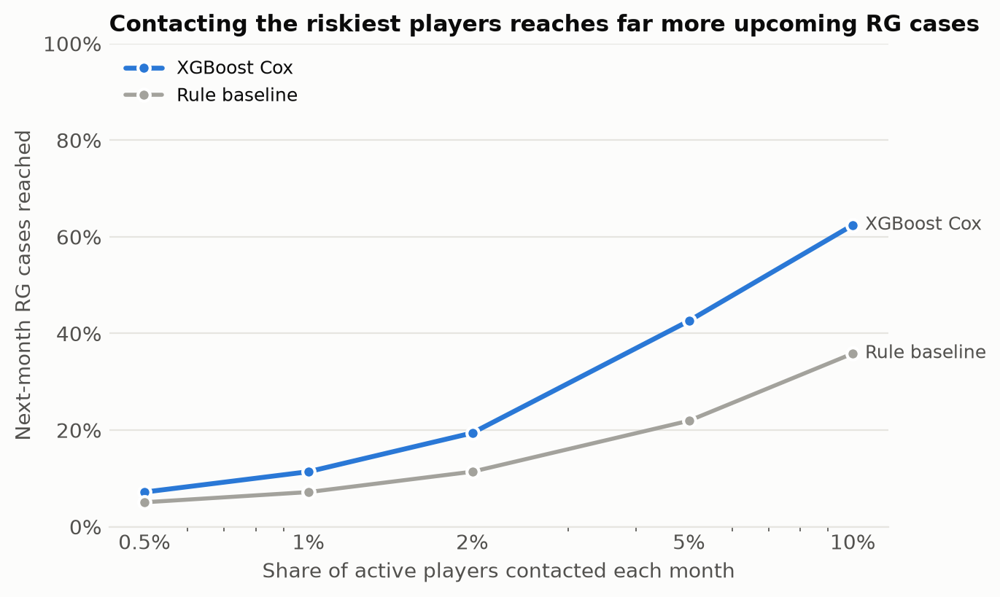
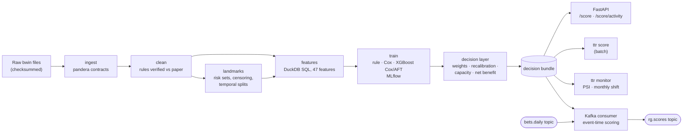

# time-to-risk-it

[](https://github.com/apayne185/time-to-risk-it/actions/workflows/ci.yml)


**Player-risk early warning for online betting.** Survival models predict how soon an active
player is likely to trigger a responsible-gambling (RG) intervention, and a decision layer turns
that into a monthly contact policy an RG team can act on: who to contact, what it buys, and what
it costs.

Built on real betting histories of 4,134 bwin players (Harvard Division on Addiction /
Transparency Project), from raw files to a monitored FastAPI service.



- **Contacting the riskiest 10% of active players each month reaches 62% of those who trigger an
  RG intervention in the next 30 days**, against 36% for an operator-style rule (43% vs 22% at a
  5% budget).
- **Ranking holds up out of time** (test Aug–Oct 2009, trained on earlier months): within-month
  AUC 0.785, C-index 0.77 for the gradient-boosted survival models vs 0.69 for the rule.
- **Calibration drift is caught and fixed without retraining**: RG interventions rose through
  2009, a static model under-predicted 2.6×, and a monthly intercept update using only
  already-observed outcomes brings observed/expected to 1.12.

## What makes it more than a model

The interesting work was in not fooling myself. Each decision is written up as an
[architecture decision record](docs/decisions/):

- **Replicate before extending.** The paper's 27 betting indices reproduce exactly for ≥95% of
  players, and its main finding (live-action betting intensity) replicates. Re-running its
  analysis on *pre-intervention data only* shows part of its separation came from betting after
  the intervention ([EDA report](reports/eda.md)).
- **The label is not what it seems.** 841 "cases" were accounts already closed or self-excluded:
  they stop betting six months *before* their event. Left in, they teach a model that quitting is
  a risk signal. They are excluded from the primary label ([ADR 0002](docs/decisions/0002-primary-label.md)).
- **Leakage is designed out and tested.** Monthly landmarks score players only on their past;
  labels are censored at split boundaries so no outcome crosses from validation into training;
  property tests inject extreme future activity and assert no feature moves
  ([ADR 0003](docs/decisions/0003-landmark-design.md), [features](docs/features.md)).
- **The sampling design is corrected, not ignored.** It is a matched case-control sample, so late
  in the window every at-risk case is *guaranteed* an event. Calendar features are banned,
  ranking is scored within each month, and probabilities are reweighted to an assumed population
  rate with a sensitivity range ([ADR 0005](docs/decisions/0005-decision-layer.md)).
- **No demographic features.** Missing demographics identify 167 controls (a leak), and RG
  contact decisions should rest on behaviour. Demographics are used only to audit performance by
  subgroup ([ADR 0004](docs/decisions/0004-no-demographic-features.md)).

## How it works



Every stage is a `ttr` command and a `make` target; the same pipeline runs on a schema-faithful
synthetic dataset in CI.

## Results

Test split: Aug–Oct 2009, 1,814 player-months, models selected on earlier months only.

| Model | Within-month C (90-day) | AUC (30-day) | Reached @ 1% | @ 5% | @ 10% |
|---|---|---|---|---|---|
| Rule baseline (frequency, live share, escalation) | 0.693 | 0.715 | 7% | 22% | 36% |
| Cox (stratified by month) | 0.759 | 0.775 | 13% | 34% | 52% |
| **XGBoost Cox** (decision model, chosen on out-of-fold AUC) | 0.768 | 0.785 | 11% | 43% | 62% |
| XGBoost AFT | 0.771 | 0.792 | 14% | 44% | 63% |
| PyTorch discrete-time hazard net (comparison only, [ADR 0010](docs/decisions/0010-neural-hazard-model.md)) | 0.750 | 0.761 | 4% | 32% | 50% |

What the score responds to: recency of betting, peak daily stakes, and how many product types a
player mixes in a day ([drivers](reports/figures/drivers.png)). Full analysis, calibration,
net benefit, subgroups and label sensitivity: **[decision-layer report](reports/evaluation.md)**.
For a non-technical summary: **[memo to the RG team](reports/stakeholder_memo.md)**.

## Quickstart

Requires [uv](https://docs.astral.sh/uv/). No data licence needed for the demo.

```bash
make install    # dependencies + git hooks
make demo       # full pipeline on synthetic data: ingest → … → evaluate → monitor
make test       # 139 tests; real-data tests skip without the licensed files
```

Serve the demo model and score a player:

```bash
uv run ttr serve --bundle data/models/synthetic/decision_model.joblib
curl -s localhost:8000/model
# or in Docker (mounts the model, never bakes it in):
make docker-demo
```

Stream it instead: replay betting activity through Redpanda (Kafka API) and score players online
as each month closes, with features identical to the offline pipeline
([ADR 0007](docs/decisions/0007-streaming.md)):

```bash
make stream-demo   # needs Docker; replay → online scoring → rg.scores topic
```

Deploy to AWS (ECS Fargate behind an ALB, model bundle from S3, GitHub OIDC deploys; templates
validated offline, not yet run in a live account): see **[docs/deploy-aws.md](docs/deploy-aws.md)**.

With the real data (free registration, see [docs/data.md](docs/data.md)):

```bash
make evaluate   # ingest, clean, landmarks, features, train (MLflow), decision layer
make mlflow-ui  # browse runs
```

Add `?notes=true` to either scoring endpoint for a plain-language note per player (template by
default; `TTR_NOTES_MODE=claude` with `uv sync --extra llm` for Claude-written, guard-checked notes).

An example response from `POST /score/activity` (raw daily activity in, explained score out):

```json
{
  "player_id": 109445,
  "probability_30d": 0.0077,
  "flagged": false,
  "top_drivers": [
    {"feature": "log_max_day_stakes_365d", "description": "log(1 + largest single-day stake in EUR), last 365 days", "contribution": 0.18},
    {"feature": "days_since_last_bet", "description": "Days since the most recent bet", "contribution": 0.17}
  ]
}
```

## Engineering

- **Python 3.12, uv, ruff, mypy `--strict`**, pre-commit hooks running the locked tool versions.
- **139 tests**: unit, Hypothesis property tests (outcome invariants, feature leakage), end-to-end
  pipeline runs on synthetic data, API/batch parity, online/offline feature parity, and real-data
  regression tests that pin reproduction of the published paper.
- **Data contracts** with pandera; SHA-256 checks on the raw files; a hook blocks licensed data
  from ever being committed.
- **SQL feature layer** in DuckDB ([sql/features](sql/features)), including window functions for
  loss chasing.
- **PyTorch**: a discrete-time neural hazard model trained on the censored likelihood, with early
  stopping and gradient × input explanations; CPU wheels via a uv index. It trails gradient
  boosting on this tabular data and is kept as a comparison, chosen out of serving before its
  results were known ([ADR 0010](docs/decisions/0010-neural-hazard-model.md)).
- **MLflow** tracking (git SHA and feature-table hash on every run), deterministic retraining.
- **FastAPI** service with typed request/response schemas, a lean Docker image (training extras
  excluded), and **PSI drift monitoring** with a monthly recalibration job.
- **LLM notes for agents**: Claude turns a score's drivers into a short note and a supportive
  opener, through structured output and a guard that rejects invented numbers, diagnostic or
  promotional language and model jargon; failures fall back to a deterministic template
  ([ADR 0009](docs/decisions/0009-agent-notes.md)). The Claude path is tested against a fake
  client; a live evaluation (`make notes-eval WRITER=claude`) has not been run yet.
- **AWS**: CloudFormation for ECS Fargate + ALB, a private versioned model bucket, readiness-gated
  rolling deploys with automatic rollback, autoscaling and alarms, deployed through GitHub OIDC
  with no stored keys ([ADR 0008](docs/decisions/0008-aws-deployment.md)).
- **Streaming**: an event-time Kafka consumer (Redpanda) that scores players online, at-least-once
  with a dead-letter topic, tested for parity with the offline features and run end to end
  against a real broker in CI.
- **GitHub Actions**: lint, types, tests, synthetic end-to-end run, live API smoke test,
  streaming through Redpanda, CloudFormation lint, image build; a manual, approved AWS deploy
  workflow. Work is merged through PRs with required checks.

## Repository map

```
src/ttr/
  data/        ingest, cleaning, synthetic data twin
  analysis/    paper replication, trajectories
  landmarks.py risk sets, censored outcomes, temporal splits
  features.py  feature registry + DuckDB runner (SQL in sql/features/)
  models/      rule baseline, stratified Cox, XGBoost Cox/AFT, PyTorch hazard net
  train.py     selection, refit, MLflow tracking
  evaluate/    weights, calibration, net benefit, capacity, subgroups, report
  explain.py   TreeSHAP / linear contributions, top drivers
  serve/       scoring core and FastAPI app
  stream/      event schemas, event-time StreamScorer, Kafka adapters
  notes/       agent notes: facts, guard, template and Claude writers, evaluation
  monitor.py   PSI drift, monthly intercept shift
configs/       data, labels, landmarks, models, decision policy
infra/aws/     CloudFormation: foundation, GitHub OIDC deploy access, scoring service
docs/          data access, features, model card, decision records
reports/       generated reports and figures
```

## Responsible use and limitations

The score is meant to prioritise a **human review and a supportive contact**. It must not be used
to restrict, target or market to players. Data is from 2005–2010 and one operator; the outcome is
an operator intervention, not confirmed harm; absolute risks depend on an assumed population
rate; players inactive for 90 days are never scored. Details in the
**[model card](docs/model_card.md)**.

## Data and citation

Gray, H. M., LaPlante, D. A., & Shaffer, H. J. (2012). Behavioral characteristics of Internet
gamblers who trigger corporate responsible gambling interventions. *Psychology of Addictive
Behaviors*, 26(3), 527–535. Data: [The Transparency Project](http://www.thetransparencyproject.org/),
Division on Addiction, Cambridge Health Alliance. The data is licensed and not redistributed here.

Code: MIT.
