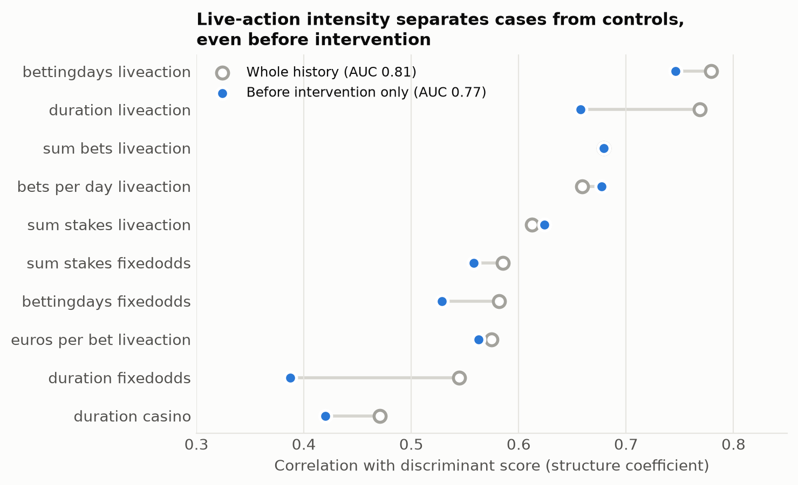
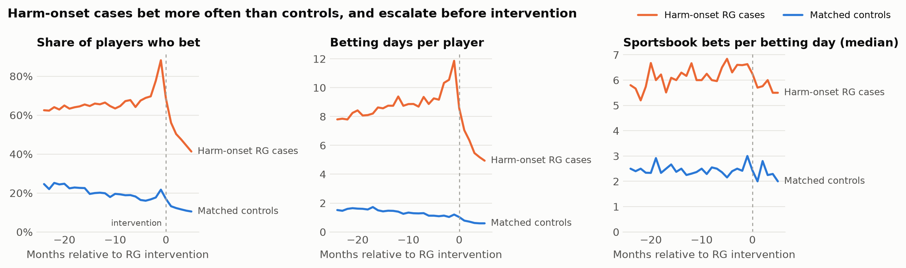

# Exploratory analysis and replication

Generated by `ttr eda`. Cohort and cleaning rules: [docs/data.md](../docs/data.md).

## 1. Replication of Gray, LaPlante & Shaffer (2012)

The paper compared RG cases and matched controls with a discriminant function analysis (DFA) on
27 betting indices (nine each for fixed-odds, live-action and casino betting) aggregated over each
player's **whole history**. Recomputing the indices from the cleaned daily data reproduces the
paper's published values exactly for at least 95% of players on every index.

Re-running the DFA (linear discriminant analysis on square-root-transformed indices, 5-fold
cross-validated):

| Analysis | Cases / controls | AUC | Accuracy |
|---|---|---|---|
| Whole history, all cases (paper's design) | 2,021 / 1,897 | 0.805 | 74% |
| Before intervention only, all cases | 2,021 / 1,897 | 0.769 | 68% |
| Before intervention only, harm-onset cases | 1,027 / 1,897 | 0.752 | 66% |

**The paper's main finding replicates:** the indices most correlated with the discriminant score are
measures of live-action betting intensity. Before intervention, the top four are `bettingdays_liveaction`, `sum_bets_liveaction`, `bets_per_day_liveaction`, `duration_liveaction`.

**But the paper's design looks ahead.** Whole-history indices include betting *after* the
intervention. Restricting each player to activity before their index date (a case's first RG
event; for a control, the RG date of a case with the same first-deposit date) lowers AUC from
0.81 to 0.77. Most of the separation was available in time to act on,
which is what an early-warning model needs, but a model evaluated on whole-history features
would overstate its usefulness.

Restricting cases to harm-onset events (the project's primary label, which drops accounts that
were already closed and non-harm events; see section 2) gives AUC 0.75.

## 2. Activity in the months before intervention

### Already-closed accounts are not harm onset

For many cases the first RG event in the study window concerns an account that was **already
closed or self-excluded**: either it was re-opened, or a request to re-open was refused. Their
activity shows the exclusion period directly. Almost none of them bet in the six months before
the event:

Share of players who bet, by month relative to the event:

| First RG event | n | -9 | -7 | -6 | -3 | -1 | +0 |
|---|---|---|---|---|---|---|---|
| Account re-opened after closure | 559 | 21% | 18% | 3% | 3% | 6% | 90% |
| Account remains closed | 282 | 36% | 32% | 7% | 5% | 7% | 2% |

These players' harm began before the window, so they are prevalent rather than incident cases.
The primary label (`configs/labels.yaml`, ADR 0002) excludes them, and the rest of this section
uses harm-onset cases only.

### Harm-onset cases escalate before intervention

Aligning every player on their index date shows that cases differ from controls throughout, and
that their activity **escalates in the last two to three months** before intervention:

| Month | Cases betting | Controls betting | Case betting days | Control betting days |
|---|---|---|---|---|
| -12 | 66% | 20% | 9.4 | 1.4 |
| -6 | 64% | 18% | 8.9 | 1.1 |
| -3 | 70% | 17% | 10.3 | 1.1 |
| -2 | 78% | 18% | 10.5 | 1.0 |
| -1 | 88% | 22% | 11.9 | 1.2 |
| +0 | 68% | 17% | 8.6 | 1.0 |
| +3 | 47% | 12% | 5.5 | 0.6 |

Notes:
- Month 0 starts on the intervention date, so it already contains post-intervention activity.
- Sportsbook intensity (median bets per betting day) is roughly 2.5x higher for cases but does
  not rise before intervention. The early signal is in *how often* players bet, not how much
  per day.

## 3. Implications for modelling

1. Features must be computed strictly from activity before the scoring date (landmark design).
2. Recent change matters: the last 1-3 months carry signal beyond long-run levels, so features
   should include short windows and ratios of recent to long-run activity.
3. Live-action betting and betting frequency are the strongest single signals. The rule baseline
   should use them.
4. Label choice changes the signal: already-closed accounts look like *de-escalation* before
   their event. Mixing them into the outcome would teach a model that stopping betting is a
   risk signal.
