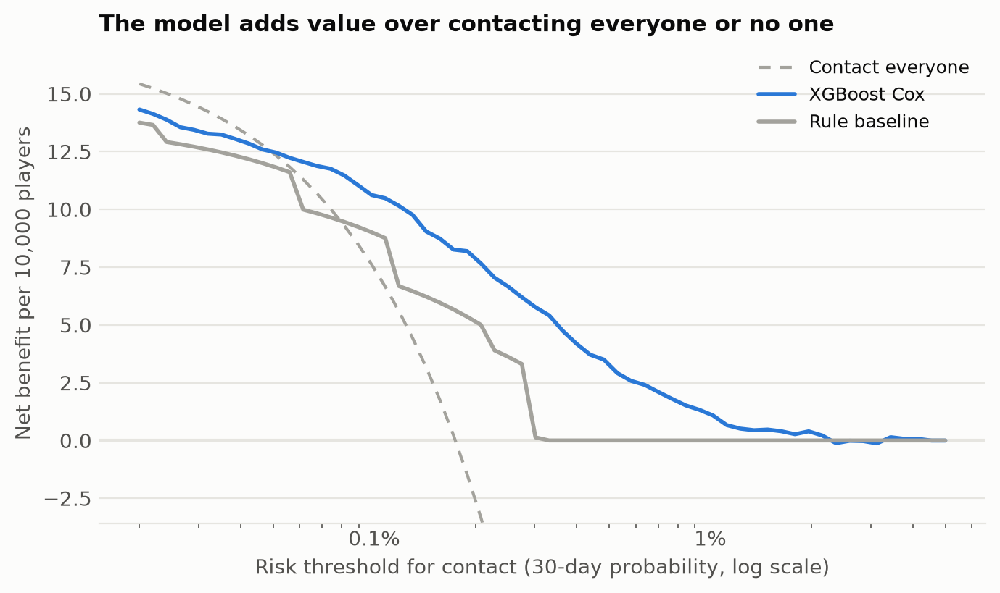
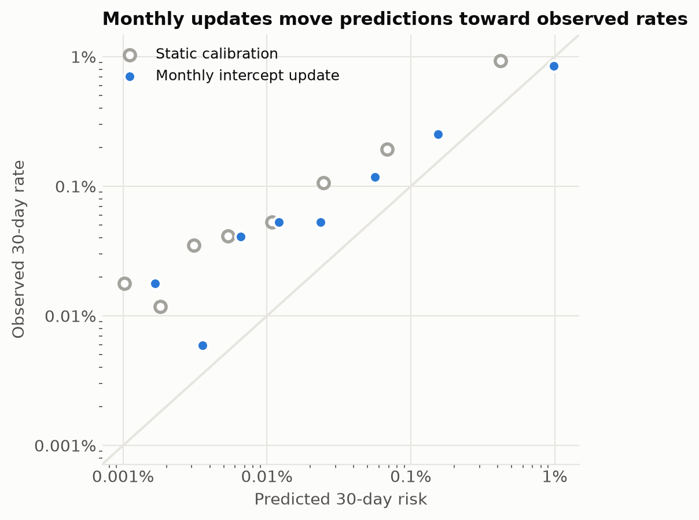
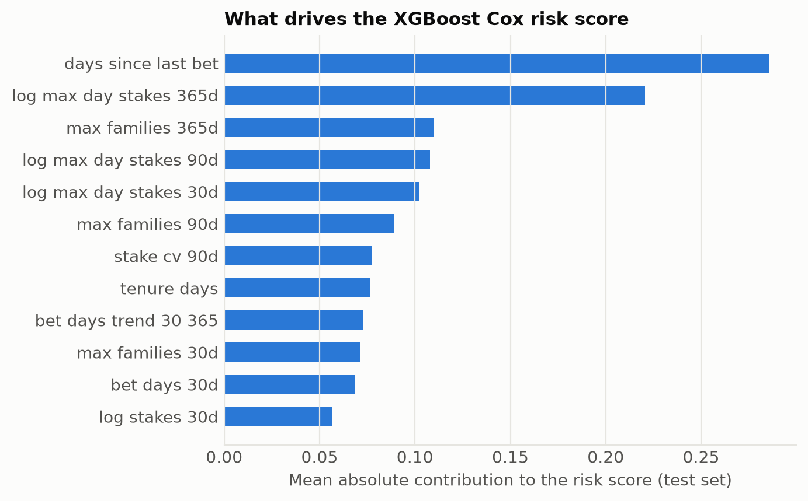

# Decision layer: who should the RG team contact this month?

Generated by `ttr evaluate --label primary`. Test split: 1,814 player-months
(Aug–Oct 2009), 237 of them followed by a harm-onset RG intervention within
30 days. Probabilities are on the active-player population scale, assuming
0.5% of active players become harm-onset cases over the 13-month
window (ADR 0005).

## Headline

**Contacting the 1% of active players with the highest XGBoost Cox risk each month reaches
11% of the players who trigger a responsible-gambling intervention in the next
30 days**, against 7% for an operator-style rule on the same
budget. With a 10% budget it reaches 62%.

Depending on the assumed population case rate, that is **12–85 contacts for
every player reached** before their intervention. Whether that is worth it depends on what a
contact costs and what it achieves, which is a decision for the RG team; the decision curve below
makes that trade-off explicit.

## Models

Out-of-fold (OOF) metrics are on train + validation with player-disjoint folds; test metrics use
the final models once. AUC is computed within each monthly landmark (ADR 0003). "Reached" is the
share of next-month RG cases who were among the contacted players, at each monthly budget.

| Model | OOF AUC | Test AUC | Reached @ 0.5% | Reached @ 1% | Reached @ 2% | Reached @ 5% | Reached @ 10% | Test O/E (static) | Calibration slope |
|---|---|---|---|---|---|---|---|---|---|
| Rule baseline | 0.689 | 0.715 | 5% | 7% | 11% | 22% | 36% | 2.31 | 0.54 |
| Cox | 0.762 | 0.775 | 8% | 13% | 21% | 34% | 52% | 2.61 | 0.83 |
| XGBoost Cox **(decision model)** | 0.771 | 0.785 | 7% | 11% | 19% | 43% | 62% | 2.59 | 0.82 |
| XGBoost AFT | 0.771 | 0.792 | 8% | 14% | 22% | 44% | 63% | 2.64 | 0.81 |

The decision model is the learned model with the best OOF AUC. The learned models are close;
all clearly beat the rule baseline.

## Net benefit

A contact threshold of *t* means accepting (1 − *t*)/*t* unnecessary contacts to reach one
player who goes on to trigger an intervention (Vickers & Elkin, 2006). Net benefit counts reached
cases minus unnecessary contacts weighted by that exchange rate, per 10,000 active players.

The model beats both contacting everyone and contacting no one for thresholds from 0.05% to 4.15%, and is at or above the rule baseline at 100% of those thresholds.

## Calibration

A static calibration fitted on the training months **under-predicts the test months**: observed 30-day events were 2.6× the predicted number. On the real data, RG interventions per month rose through 2009, so the base rate drifted while the ranking held up.

The production fix is a monthly intercept update: before each scoring run, shift the calibration
so last month's predictions match last month's observed rate (whose 30-day outcomes are complete
by then). This uses no future information and leaves the ranking unchanged. Monthly logit shifts:
Aug: +0.14, Sep: +0.94, Oct: +1.13. With it, observed/expected is **1.12**.

The calibration slope after updating is 0.70 (ideal 1.0):
predictions are too spread out (high risks too high, low risks too low).
This does not affect who is contacted under a capacity policy, but probability-threshold
policies should be revisited once more recent data is available.

## Sensitivity to the assumed population case rate

The case-control sample cannot reveal how common RG cases are among all active players. Recall
barely moves with the assumption; precision and contacts per case scale with it.

| Assumed case rate (13 months) | Monthly event rate | Reached | Precision | Contacts per case reached |
|---|---|---|---|---|
| 0.25% | 0.087% | 11% | 1.2% | 85 |
| 0.50% (headline) | 0.174% | 11% | 2.3% | 44 |
| 1.00% | 0.349% | 11% | 4.4% | 23 |
| 2.00% | 0.698% | 11% | 8.1% | 12 |

## Subgroups

XGBoost Cox on the test split, with the monthly intercept update. Demographics are not model inputs
(ADR 0004); 167 controls with missing demographics are excluded here. ⚠ marks groups with fewer
than 20 events, where estimates are noisy.

| Attribute | Group | Rows | Events | AUC | O/E |
|---|---|---|---|---|---|
| gender | F | 178 | 29 | 0.88 | 2.10 |
| gender | M | 1,636 | 208 | 0.77 | 1.05 |
| age band | 18-24 | 403 | 47 | 0.83 | 1.02 |
| age band | 25-34 | 800 | 103 | 0.76 | 0.89 |
| age band | 35-49 | 426 | 71 | 0.75 | 1.63 |
| age band | 50+ | 110 | 16 ⚠ | 0.82 | 3.47 |
| country | France | 139 | 18 ⚠ | 0.72 | 0.78 |
| country | Germany | 689 | 106 | 0.78 | 1.81 |
| country | Other | 699 | 86 | 0.79 | 0.86 |
| country | Poland | 106 | 14 ⚠ | 0.79 | 1.17 |
| country | Spain | 106 | 13 ⚠ | 0.78 | 0.87 |

Ranking quality is broadly similar across groups, but calibration is off for: gender F (O/E 2.1, 29 events), age band 35-49 (O/E 1.6, 71 events), age band 50+ (O/E 3.5, 16 events), country Germany (O/E 1.8, 106 events). A deployment should monitor per-group calibration and, if a gap persists, recalibrate per group rather than add demographic features.

## What drives the score

Mean absolute contribution of each feature to the XGBoost Cox risk score on the test split (exact
TreeSHAP values for tree models, linear contributions for Cox).

## Label sensitivity

Test within-landmark C under the primary label (harm onset, ADR 0002) and the broad label (every
RG event, as in the original paper):

| Model | Primary label: test C | Broad label: test C |
|---|---|---|
| Rule baseline | 0.693 | 0.684 |
| Cox | 0.759 | 0.747 |
| XGBoost Cox | 0.768 | 0.760 |
| XGBoost AFT | 0.771 | 0.762 |

## Limitations

- Data from 2005–2010, one operator, mainly German-speaking markets. Products, regulation and
  RG processes have changed since.
- The outcome is an operator RG intervention, not confirmed harm; a model trained on it partly
  learns what the operator's RG team noticed.
- Absolute risks depend on the assumed population case rate (shown above).
- Players who were not active in the 90 days before a scoring date are never scored: 205 of
  1,034 harm-onset cases fall in this gap (ADR 0003).
- The score supports a human review and a supportive contact. It must not be used to restrict,
  target or market to players.
